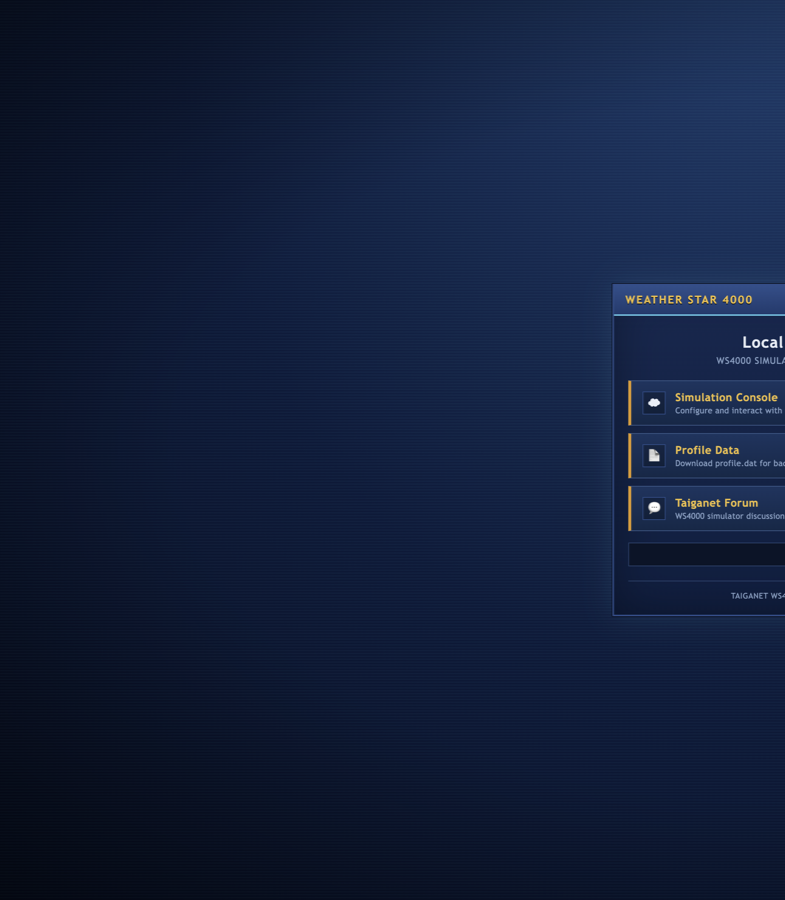

# ws4000-k8s

WS4000 simulator in Docker/Wine. Streams to Kick via ffmpeg sidecar.



## Quick start

### 1. Get the simulator

```bash
git clone https://github.com/coconitro/ws4000-k8s.git
cd ws4000-k8s
./build/download-ws4000.sh
```

This pulls the Taiganet WS4000v4 archive into `assets/ws4000/` (not committed to git).

### 2. Add your config files

Create a config directory on your machine (any path you like):

```text
~/ws4000-config/
  Config.w4k              # required
  profile.dat             # created in step 3
  ws4000-logo.png         # optional — stream overlay
  ws4000-background.jpg   # optional — X11 wallpaper when sim is idle
```

**Config.w4k** — WS4000’s main settings file. The Taiganet download often includes one; if not, grab a starter from the [Taiganet forum](https://www.taiganet.com/forum/index.php/topic,4135.0.html) and save it as `Config.w4k` in your config folder (and copy a copy into `assets/ws4000/` for local runs).

**Logo and background** — PNG/JPG files you choose. Defaults in Helm are `ws4000-logo.png` and `ws4000-background.jpg`; rename yours or set `branding.streamLogo` / `branding.x11Background` in values.

### 3. Tune profile.dat locally

Copy `Config.w4k` into `assets/ws4000/`, then run the stack locally (the Taiganet archive usually includes a default `profile.dat` too):

```bash
cp ~/ws4000-config/Config.w4k assets/ws4000/
CONFIG_MOUNT=~/ws4000-config ./build/run-local.sh
```

Open **http://localhost:6080/vnc.html**, configure locations, music paths, and graphics in the simulator, then export your profile:

```bash
./build/export-profile.sh   # writes assets/ws4000/profile.dat
cp assets/ws4000/profile.dat ~/ws4000-config/
```

Add your logo and background images to `~/ws4000-config/` if you have them.

### 4. Deploy to Kubernetes

```bash
cp deploy/helm/ws4000/values.example.yaml my-values.yaml
```

Edit `my-values.yaml` — at minimum set Kick keys, ingress host, music path, and enable the config volume:

```yaml
kick:
  streamKey: "YOUR_KEY"
  rtmpUrl: "YOUR_RTMP_URL"

hostPaths:
  music: /path/on/host/ws4000-music   # XSPF + MP3s live here

config:
  enabled: true
  type: hostPath                    # or nfs / pvc
  hostPath:
    path: /path/on/host/ws4000-config

branding:
  streamLogo: ws4000-logo.png
  x11Background: ws4000-background.jpg

ingress:
  host: ws4000.example.com
```

Seed the config directory on the host (or NFS export):

```bash
./build/seed-config-volume.sh --src ~/ws4000-config --dest /path/on/host/ws4000-config
```

Install:

```bash
helm upgrade --install ws4000 oci://ghcr.io/coconitro/ws4000 \
  -f my-values.yaml
```

Web UI: `http://<ingress.host>/` (console at `/vnc.html`, profile download at `/export/profile.dat`).

More detail: [docs/DEPLOYMENT.md](docs/DEPLOYMENT.md) · GPU encoding: [docs/GPU.md](docs/GPU.md)

## Scripts

| Script | Purpose |
|--------|---------|
| `./build/download-ws4000.sh` | Download Taiganet simulator binaries |
| `./build/run-local.sh` | Local Docker + noVNC test |
| `./build/export-profile.sh` | Pull profile.dat from local or cluster |
| `./build/seed-config-volume.sh` | Copy config/branding onto host or NFS |
| `./build/push-image.sh` | Build and push to GHCR |
| `./build/publish-chart.sh` | Publish Helm chart to GHCR |

Simulator binaries and personal config are not in git. Run `./build/download-ws4000.sh` before building.
