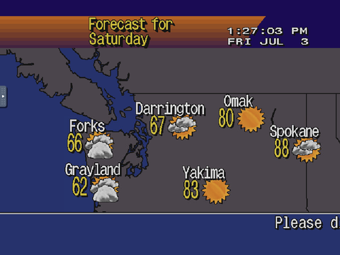

# ws4000-k8s

WS4000 simulator in Docker/Wine. Streams to Kick via ffmpeg sidecar.

This project runs **[Taiganet's WS4000v4 simulator](https://www.taiganet.com/)** — a faithful, feature-rich recreation of the classic Weather Star 4000. None of the magic is ours; it all comes from their software and the community around it. Many thanks to Taiganet for building and sharing it. Grab `Config.w4k` and join the discussion on the [Taiganet forum](https://www.taiganet.com/forum/index.php/topic,4135.0.html).

<table>
<tr>
<td></td>
<td></td>
</tr>
</table>

**Why Kubernetes instead of a desktop?** A Windows or Linux box running Wine needs someone logged in, survives reboots poorly, and dies quietly when the simulator crashes. This stack runs headless in containers with liveness probes, automatic restarts, and your `profile.dat` / branding on a persistent volume — so the stream keeps going without babysitting a PC.

## Quick start

Image and Helm chart are published to GHCR — no clone or local build required.

### 1. Prepare host storage

On your cluster node (or NFS export):

```text
/path/on/host/ws4000-music/     # XSPF playlist + MP3s
/path/on/host/ws4000-config/   # optional — see step 3
  Config.w4k                   # from Taiganet download or forum
  profile.dat                  # created in the simulator
  ws4000-logo.png              # optional
  ws4000-background.jpg        # optional
```

**Config.w4k** — grab from the [Taiganet WS4000 forum](https://www.taiganet.com/forum/index.php/topic,4135.0.html) if you do not already have one.

### 2. Install from GHCR

```bash
curl -sLO https://raw.githubusercontent.com/coconitro/ws4000-k8s/main/deploy/helm/ws4000/values.example.yaml
cp values.example.yaml my-values.yaml
# edit kick.*, ingress.host, hostPaths.music, ingress.basicAuth.password
helm upgrade --install ws4000 oci://ghcr.io/coconitro/ws4000 \
  -f my-values.yaml
```

The chart defaults to `ghcr.io/coconitro/ws4000:latest` — simulator binaries are already in the image.

Minimum values to set:

```yaml
kick:
  streamKey: "YOUR_KEY"
  rtmpUrl: "YOUR_RTMP_URL"

hostPaths:
  music: /path/on/host/ws4000-music

ingress:
  host: ws4000.example.com
  basicAuth:
    password: "YOUR_PASSWORD"
```

### 3. Configure in the cluster

Open **`http://<ingress.host>/vnc.html`**, set locations, music paths, and graphics in the simulator. Download **`/export/profile.dat`** when done.

To persist config across pod restarts, copy `Config.w4k` and `profile.dat` onto your host config path and enable the volume:

```yaml
config:
  enabled: true
  type: hostPath    # or nfs / pvc
  hostPath:
    path: /path/on/host/ws4000-config
```

Then `helm upgrade` again. Landing page: `http://<ingress.host>/`.

More detail: [docs/DEPLOYMENT.md](docs/DEPLOYMENT.md) · GPU encoding: [docs/GPU.md](docs/GPU.md)

## Scripts

For local development and publishing — not needed to deploy from GHCR.

| Script | Purpose |
|--------|---------|
| `./build/download-ws4000.sh` | Download Taiganet simulator binaries (image builds only) |
| `./build/run-local.sh` | Local Docker + noVNC test |
| `./build/export-profile.sh` | Pull profile.dat from local or cluster |
| `./build/seed-config-volume.sh` | Copy config/branding onto host or NFS |
| `./build/push-image.sh` | Build and push to GHCR |
| `./build/publish-chart.sh` | Publish Helm chart to GHCR |
